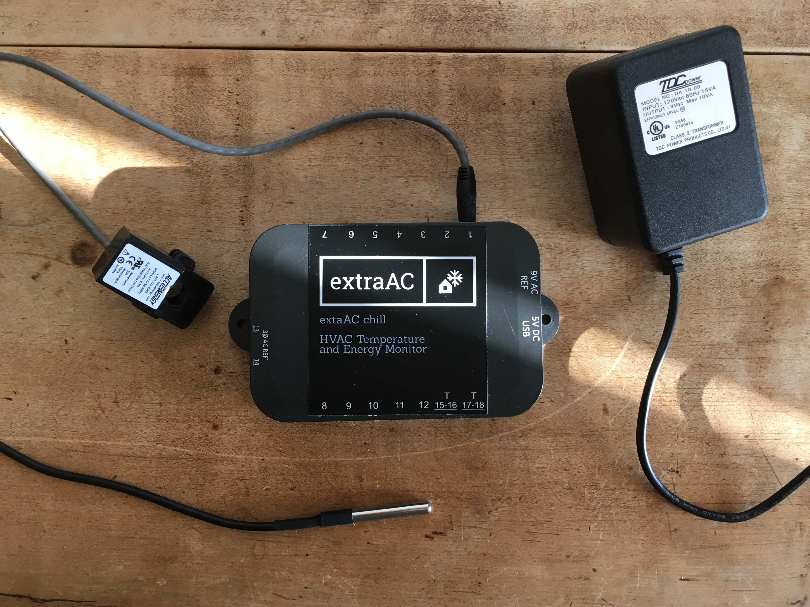
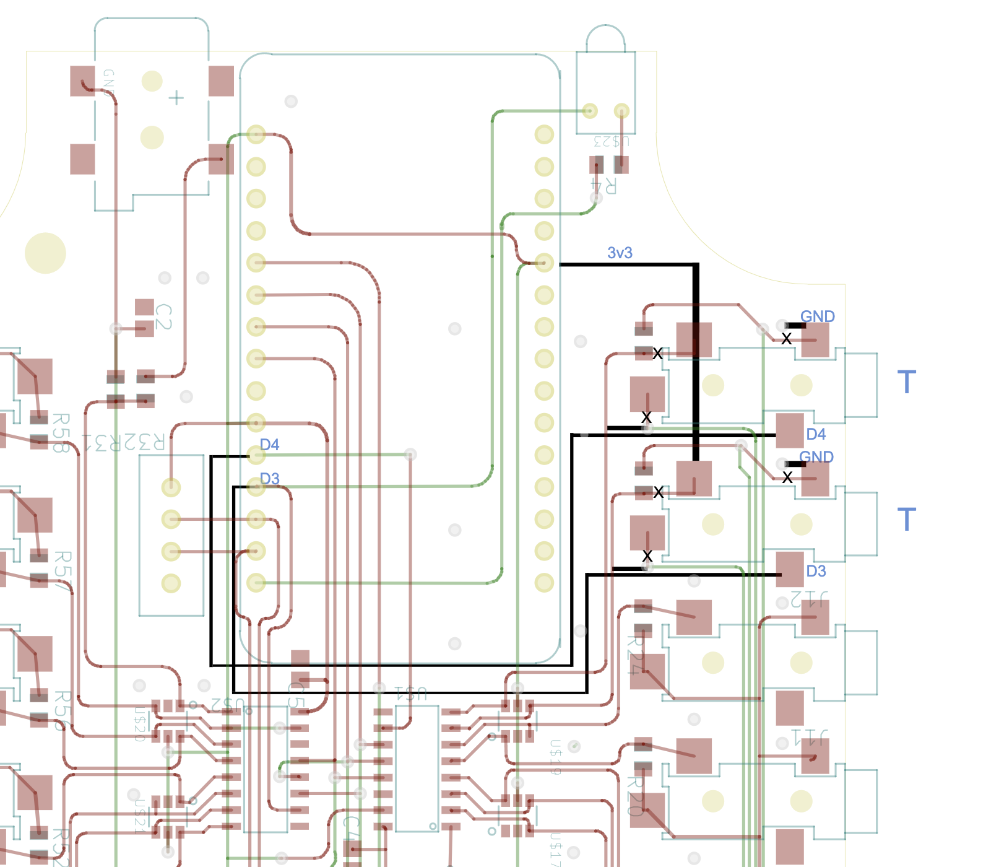
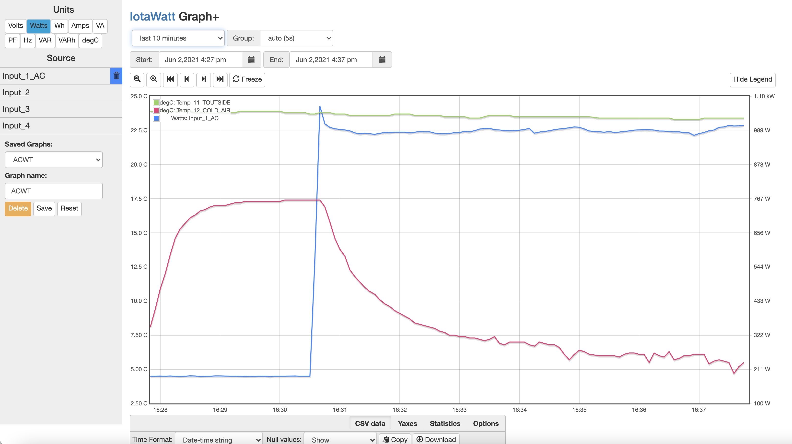

=========================================
extraAC WiFi Electricity Monitor Project
=========================================

IoTaWatt is an open-source, open hardware project to produce an accurate, 
inexpensive and easy to use energy monitor.  

extraAC is a fork to add DB18B20 temperature sensing to the Iotawatt platform.

Temperature sensor support (DS18B20) is on ports 13 and 14. Two temperature sensors are supported per port.

## Convert your IotaWatt into an extraAC

Make the following hardware changes to the IotaWatt circuit board:
Connect ports 13,14 to the NodeMCU D3 and D4 instead of the ADC (cutting a few traces and adding a few wires). 

    Circuit board modifications to change ports 13,14 to temperature ports

Build this repository using PlatformIO and upload to your IotaWatt to add the extraAC temperature probe functionality

The modified user interface:

    Example user interface 

